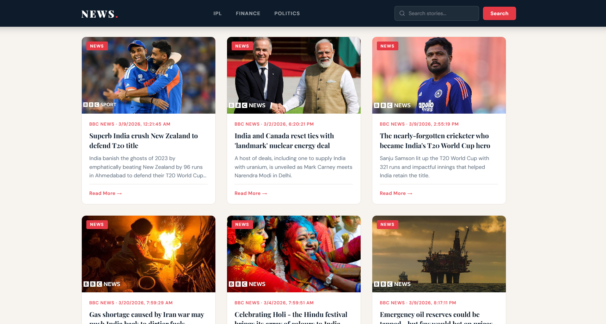

# News App 📰

A clean and responsive news aggregator web app built with vanilla HTML, CSS and JavaScript.
Stay updated with real-time news fetched directly using News API.
Simple, fast and easy to use — just open and read!

---

## 📸 Preview



---

## ✨ Features

- Real-time news fetching
- Clean and responsive design
- Simple and fast user experience

---

## 🛠️ Tech Stack

- HTML5
- CSS3
- JavaScript
- News API

---

## 🚀 How to Run Locally

1. Clone the repository
```bash
git clone https://github.com/apatheticdev-saad/news-app.git
```
2. Create a `config.js` file in the root folder:
```javascript
const CONFIG = {
  API_KEY: "your_news_api_key_here"
}
```
3. Open `index.html` in your browser

---

## 👤 Author

**Saad**
- GitHub: [@apatheticdev-saad](https://github.com/apatheticdev-saad)